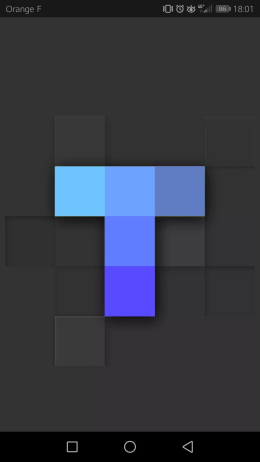
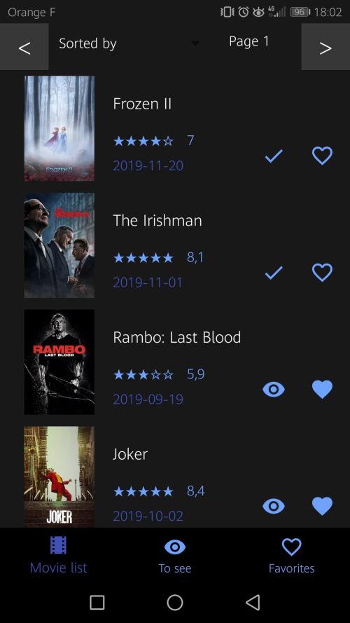
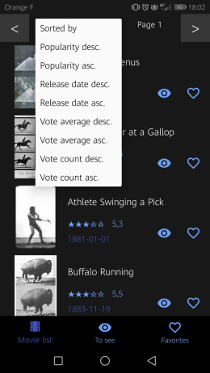
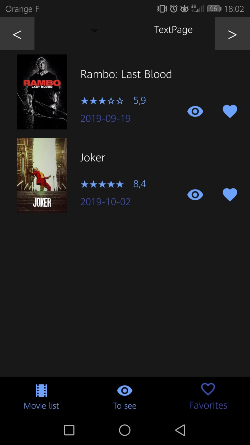
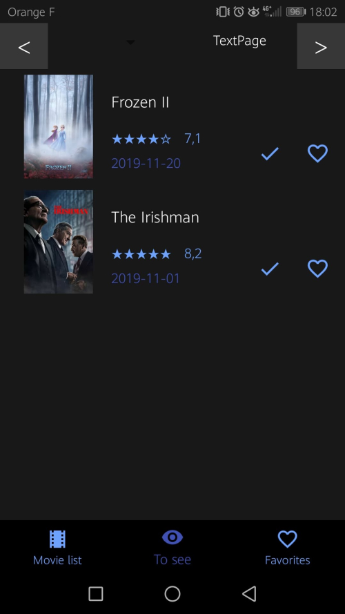
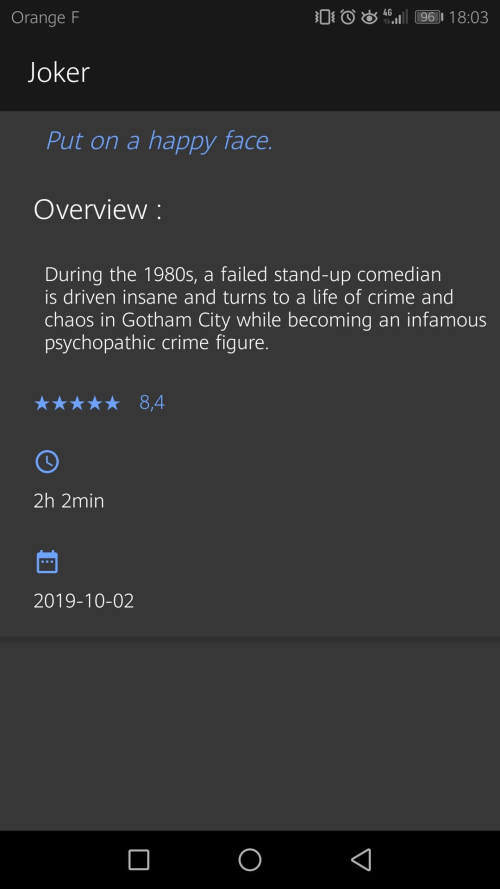

# TheMovieDatabase

PS : j'ai rencontré quelques problèmes sur l'ancien dépôt du projet. Le premier commit datait du 25 octobre 2019.

## Présentation

Application mobile en Java, utilisant l'architecture MVC.

L'application est basée sur l'API "TheMovieDatabase" et sur le design de l'application "TV Time".
Elle affiche la liste de tous les films existants (ou non) et leurs détails, permet à l'utilisateur de trier cette liste selon certains critères.
L'utilisateur peut également gérer une liste de "favoris" et une listes de "films à voir".

## Outils de développement

- Environnement de développement : Android Studio

- Librairie pour effectuer des appels à des webservices REST sur Android Studio : Retrofit2

- Ensemble de règles de design proposées par Google : Material Design

## Consignes et fonctionnalités

- Deux activités et 3 fragments
- Utilisation de *RecyclerView
- Appel webservices à une API REST : <a href="https://www.themoviedb.org/documentation/api">TheMovieDatabase</a>
- Stockage des données en cache avec un singleton
- Utilisation des SharedPreferences pour sauvegarder les listes "favoris" et "à voir"
- Architecture MVC
- SplashScreen
- GitFlow
- Material Design : design basé sur l'application <a href="https://play.google.com/store/apps/details?id=com.tozelabs.tvshowtime&hl=fr">TV Time</a>

### SplashScreen

Ecran de lancement de l'application

### Liste de films

Liste affichée à l'aide du *RecyclerView*. Le contenu de la liste est récupéré à l'aide d'un appel webservice REST.

La liste peut être triée selon les options affichées. Lorsqu'on choisit une option, cela relance un appel webservice REST avec l'option sélectionnée. Le principe est le même pour la pagination.

Cette liste est stockée en cache : lorsqu'on relance l'application, la liste ne se recharge pas. Elle est également disponible hors ligne.

### Liste de favoris

Le contenu de la liste est récupérée via les SharedPreferences. Le film est stocké lorsque l'utilisateur choisit de mettre un film en favoris dans l'écran "Movie list". La liste reste sauvegardée même après avoir rechargé l'application. La liste est disponible hors ligne.

### Liste de films à voir
Cette liste fonctionne sur le même principe que la liste de "favoris".

### Détail d'un film

Le détail d'un film est disponible lorsqu'on clique sur son titre et ce à partir de nimporte laquelle des trois listes.
Le détail d'un film est sauvegardé en cache. Donc, à condition de l'avoir précédemment chargé, le détail est disponible hors ligne.

L'affichage du détail utilise Material Design : L'image se compresse lorsu'on scroll l'écran vers le bas.

## Architecture MVC
<pre><code>
+-- app/
|   +-- manifests/
|   |   +-- AndroidManifest.xml
|   +-- java/
|   |   +-- com.example.filmdatabase/
|   |   |   +-- controller/
|   |   |   |   +-- (*.java)
|   |   |   +-- model/
|   |   |   |   +-- (*.java)
|   |   |   +-- restapi/
|   |   |   |   +-- (*.java)
|   |   |   +-- view/
|   |   |   |   +-- (*.java)
|   +-- res/
|   |   +-- drawable/, font/, layout/, menu/, mipmap/, values/
|   |   |   +-- (*.xml)
|   |   |   +-- (*.png)
+-- Gradle Scripts/
</code></pre>

