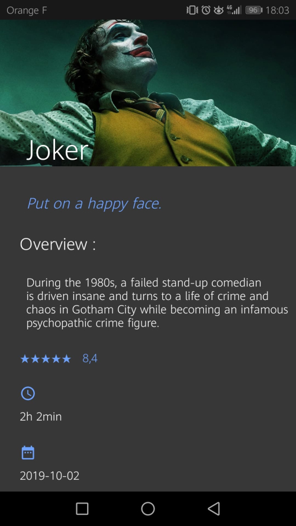

# TheMovieDatabase

## Présentation

Application mobile en Java, utilisant l'architecture MVC.

L'application est basée sur l'API "TheMovieDatabase" et sur le design de l'application "TV Time".
Elle affiche la liste de tous les films existants (ou non) et leurs détails, permet à l'utilisateur de trier cette liste selon certains critères.
L'utilisateur peut également gérer une liste de "favoris" et une listes de "films à voir".

## Outils de développement

- Environnement de développement : Android Studio

- Librairie pour effectuer des appels à des webservices REST sur Android Studio : Retrofit2

- Ensemble de règles de design proposées par Google : Material Design

## Consignes et fonctionnalités

- Deux activités et 3 fragments
- Utilisation de *RecyclerView
- Appel webservices à une API REST : <a href="https://www.themoviedb.org/documentation/api">TheMovieDatabase</a>
- Stockage des données en cache avec un singleton
- Utilisation des SharedPreferences pour sauvegarder les listes "favoris" et "à voir"
- Architecture MVC
- SplashScreen
- GitFlow
- Material Design : design basé sur l'application <a href="https://play.google.com/store/apps/details?id=com.tozelabs.tvshowtime&hl=fr">TV Time</a>

# SplashScreen

# Liste de films

# Liste de favoris

# Liste de films à voir

# Détail d'un film

